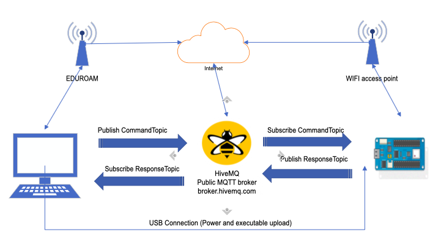
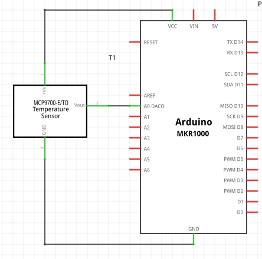
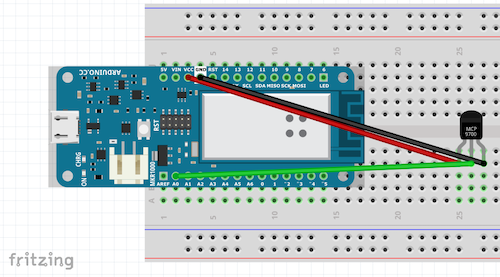
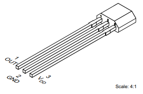

# Lab 1 - Lab setup + MQTT with Arduino MKR WiFi1010

For the lab we will use Arduino IDE: https://www.arduino.cc/en/Main/Software to program the Arduino MKR WiFi1010 board.

## Running the Arduino IDE in the VM

Continue from the instructions in the `README` file for setting up VirtualBox.

Plug the Arduino MKR Wifi 1010 with the USB cable to your laptop and be sure you enable the USB port controller and add the corresponding USB filter into the list of shared USB device (see screenshot below)


The IDE is already available from the provided VM and installed in the folder _arduinoIDE_, and should be start by executing the script _./arduinoIDE/arduino_

### Running the Arduino IDE without the VM
If you do not want to use the provided VM, it is possible to use the Arduino IDE directly on your computer (this may also be necessary in case you are not able to program the Arduino board from the IDE provided in the VM). Then you need to install the IDE from https://www.arduino.cc/en/software. 

You may also need to install some libraries in the IDE through _Sketch > Include Libraries > Manage Libraries_. At least the following libraries are needed
- _ArduinoBearSSL_
- _ArduinoECCX08_ 
- _ArduinoMqttClient_ 

You may also need to install support for the board we are using, this is done under _Tools > Board > Board Manager_. The one needed is called _Arduino AVR Boards_. 

The source files must also be downloaded from Github to your local machine.


## Lab 1 - Before you begin,

In this lab you will create a new IoT device using Arduino MKR WiFi1010 board.
The device will measure the room temperature and transmit to a remote server using
the MQTT protocol. You will establish an insecure link and measure the transmission
latency. You will also implement logic to perform actuation on the sensor based
on user commands.


Please do the following:


## Hardware and Software setup

### Arduino setup

Collect the board and the required components. You will need:

1. [Arduino MKR WiFi1010 board](https://store.arduino.cc/arduino-mkr-wifi-1010)
2. Breadboard
3. Thermistor [MCP9700](http://ww1.microchip.com/downloads/en/DeviceDoc/20001942G.pdf) if in Turku or [LMT87](http://ww1.microchip.com/downloads/en/DeviceDoc/20001942G.pdf) if in Vaasa.
4. Up to 5 breadboard connectors
5. A USB type A to USB micro cable
6. WiFi credentials for Arduino

Insert the Arduino to the breadboard. Make sure that Arduino pins are on either
sides of the central ridge of the breadboard and that all the pins are inserted
in the breadboard. (See the image below or ask me if you're unsure).

Now we will verify that Arduino IDE has read and write access to the Arduino
board.  In the Arduino IDE, open the Sketch `TestLed` available from the folder Lab1. Select the board _MKR WiFI 1010_  (Tools->Board->SAMD 32-bits ARM cortex M0+Boards) and be sure you use the correct serial port (below the selected board in the Tools menu). You might need to re-active the USB sharing from the VirtualBox menu if you do not see the correct serial port from the listed option.

Verify/compile and upload the sketch to the Arduino MKR WiFi 1010 board (in the menu Sketch->Verifu/Compile and Upload)). If
everything goes well, you must see a yellow LED blinking on the board. You are done for the Arduino setup as you can compile and upload an program on the board from the virtual environment.

## MQTT Client Setup

The overall architecture of the system you will implement is described in the figure bellow:



In order to subscribe to the messages that your Arduino board would send,
we need to setup a MQTT client on your desktop (the Ubuntu VM in your case). 
The mosquitto MQTT client is already installed on the provided VM (see https://mosquitto.org/download/)


## Arduino + Temperature Sensor

Now we are set to measure the room temperature and transmit it to a remote MQTT server.

### In Turku
First setup the hardware as shown in the circuit diagram below.



**IMPORTANT: Do not flip Vcc and GND connections. Also, do not short Vcc and GND.
Power the board via the USB cable AFTER you have verified that the circuit is correct**

The setup itself should similar to the figure below. The thermistor IC's pin
numbers are determined by holding the flat end towards you, with pins facing
downwards and counting from left. From the schematic, you connect the first pin of
the thermistor to third pin on Arduino marked as **Vcc**. Connect the second
pin of the thermistor to second pin on the Arduino situated on the other side
of the Vcc and is marked as **DAC0/A0**. Connect the third pin of the thermistor
to the fourth pin of the Arduino board, marked as **GND**. The GND pin is on the
same side as Vcc. 



### In Vaasa

The setup itself is similar to the figure above, however note that the 
thermistors pins are in different order, see 



Numbers are indicated in the figure. From the schematic, you connect the third pin of
the thermistor to third pin on Arduino marked as **Vcc**. Connect the second pin 
of the Arduino to the fourth pin of the Arduino board, marked as **GND**. GND 
pin is on the same side as Vcc. Connect the first pin of the thermistor to 
second pin on the Arduino situated on the other side of the Vcc marked 
as **DAC0/A0**. 

### For both Turku and Vaasa

Once the hardware setup is complete, open the Sketch `mqtt_unsecure` available from the Lab1 folder. 

**Note that if you are doing the labs in Vaasa**, we are using another thermistor and the code for the function `getTemp()` is different. Therefore, there is a different folder for Vaasa, and you need to rename this folder from `mqtt_unsecure_vaasa` to `mqtt_unsecure` for it to open properly in ArduinoIDE.

Have a look at the code and understand what it does before uploading the code. Change the content of the variable _group = "MyGroup"_
Use the provided WiFi username and password if needed (check the defined variable from the .h header file). Remember to check that the ArduinoMqttClient library and WiFiNINA libraries (Tools->manage Library) were installed. 

Compile the code and upload it to the board. 

Verify the state of the Arduino board by connecting to the *Monitor* _(in Tools-> Serial monitor)_ in the
IDE.  You can see the transmitted MQTT messages by subscribing on [broker.hivemq.com](http://www.mqtt-dashboard.com/index.html) to the relevant topic
(read the code to get the relevant topic). **In your VM machine** (or in, for example, a local Linux-installation) execute
the mosquitto_sub command below in a terminal. Substitute `responseTopic` within the quotes (retain the quotes) 
with the topic your device is sending the messages into. You may have to
change the topic, so read the source code.

```bash
mosquitto_sub -h broker.hivemq.com -t "responseTopic"
```

### To do

1. Read and understand the code. Specifically understand the `getTemp`
   function. Explain its working in your report. Consult the datasheet:
   [Turku](http://ww1.microchip.com/downloads/en/DeviceDoc/20001942G.pdf) or [Vaasa](https://www.ti.com/lit/ds/symlink/lmt87.pdf)
   if necessary. Get a working understanding of the
   [WiFiNINA](https://www.arduino.cc/en/Reference/WiFiNINA) and
   [ArduinoMqttClient](https://github.com/arduino-libraries/ArduinoMqttClient)
   library, although you do not have to explain the functionality in the report. (1 p)
2. What is the value returned by `mqttClient.messageQoS()` ? What does it mean? (1 p)
3. What is the value returned by `mqttClient.messageRetain()` ? What does it mean? (1 p)

## Command and Reponse

The code also has a subscriber component built in. Have a look at the subscriber function
`onMqttMessage`. This function is called when the device receives a message on a specific topic. To see it
working, open another terminal and do the following. Replace "commandTopic" with
the appropriate topic name and "command" with appropriate message (read and understand the function `onMqttMessage`).

```bash
mosquitto_pub -h broker.hivemq.com -t "commandTopic" -m "command"
```

### To do

1.  Modify your subscriber to implement these two commands (2 p):
    1. The **ON** command will turn on the onboard LED. 
    2. Similarly, the **OFF** command will turn off the onboard LED.
    3. Any other command will not generate a response. 
2. Modify the publisher to transmit messages only when an appropriate **TEMP** command
   is received. (2 p)
3. Test the implementation by sending the **ON**, **OFF** and **TEMP** commands on the relevant topic from your desktop machine (your Ubuntu VM machine) (2 p)
4. In your report provide a block diagram of the implemented system. (2 p)

Hint: Check
[String](https://www.arduino.cc/reference/en/language/variables/data-types/stringobject/)
for information about how to create strings. Read character by character and append to the string. Do not
forget to terminate with a null character (`'\0'`) in the end. 

## Wrap Up

Well, that's it for this first lab. You can move to the 2nd lab!
